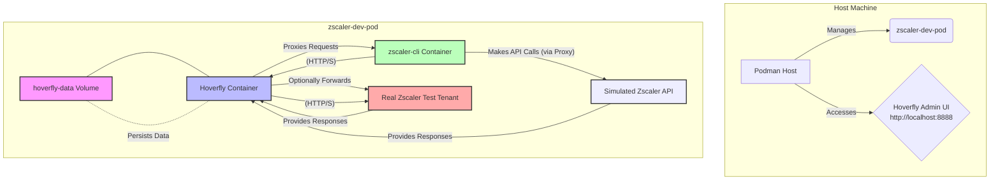
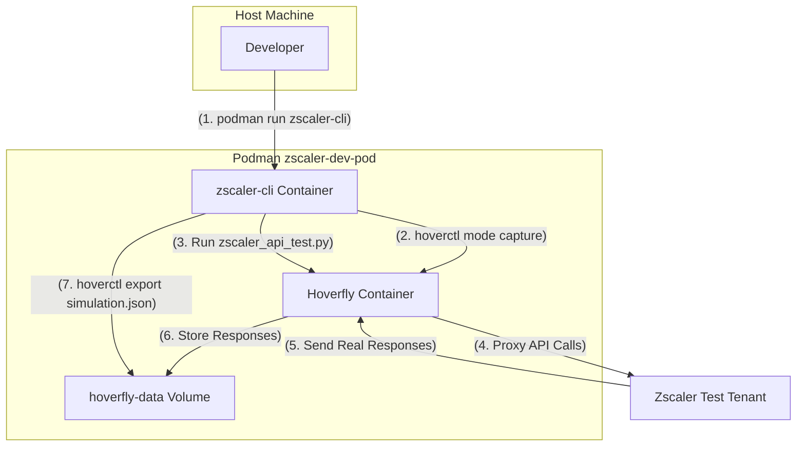
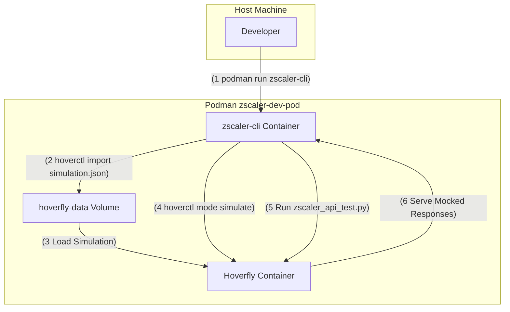

# Zscaler API Development & Mocking Environment with Podman and Hoverfly

This repository provides a self-contained Podman-based environment for developing and testing Zscaler API automation scripts using the `zscaler-sdk-python`. It leverages Hoverfly to capture real Zscaler API traffic from a test tenant and then simulate those responses for local, offline testing, eliminating the need to hit actual Zscaler environments during development cycles.

## Table of Contents

- [Overview](#overview)
- [Prerequisites](#prerequisites)
- [Environment Setup](#environment-setup)
  - [1. Build the CLI Image](#1-build-the-cli-image)
  - [2. Create Podman Volume for Hoverfly Data](#2-create-podman-volume-for-hoverfly-data)
  - [3. Create the Podman Pod](#3-create-the-podman-pod)
  - [4. Run the Hoverfly Container](#4-run-the-hoverfly-container)
  - [5. Run the CLI Container](#5-run-the-cli-container)
- [Workflow: Capture Zscaler API Traffic](#workflow-capture-zscaler-api-traffic)
  - [1. Verify Hoverfly Status](#1-verify-hoverfly-status)
  - [2. Switch Hoverfly to Capture Mode](#2-switch-hoverfly-to-capture-mode)
  - [3. Run Zscaler SDK Script Against Test Tenant](#3-run-zscaler-sdk-script-against-test-tenant)
  - [4. Export the Captured Simulation](#4-export-the-captured-simulation)
- [Workflow: Simulate Zscaler API Responses](#workflow-simulate-zscaler-api-responses)
  - [1. Switch Hoverfly to Simulate Mode](#1-switch-hoverfly-to-simulate-mode)
  - [2. Test Against the Mocked Environment](#2-test-against-the-mocked-environment)
- [Cleanup](#cleanup)
- [Mermaid Diagrams](#mermaid-diagrams)
  - [Environment Architecture](#environment-architecture)
  - [Capture Workflow](#capture-workflow)
  - [Simulate Workflow](#simulate-workflow)
- [Contributing](#contributing)
- [License](#license)

## Overview

This environment is designed to provide:

* **Isolation:** All development tools and dependencies are encapsulated within Podman containers, preventing interference with your local system.
* **Portability:** The setup can be easily reproduced on any machine with Podman installed.
* **Persistent Data:** Hoverfly's captured simulations are stored in a Podman volume, ensuring they are not lost when containers or pods are removed.
* **Realistic Mocking:** Capture real API traffic from a dedicated Zscaler test tenant for highly accurate simulations.
* **Real-time Control:** Easily switch Hoverfly between capture and simulate modes using its CLI (`hoverctl`) directly from the CLI container.

## Prerequisites

* **Podman:** Install Podman on your local machine. Refer to the [official Podman documentation](https://podman.io/docs/installation) for installation instructions.
* **Zscaler Test Tenant:** Access to a dedicated Zscaler ZIA/ZPA test or development tenant. This is crucial for capturing realistic API traffic without impacting production environments. Contact your Zscaler account team if you don't have one.
* **Zscaler API Credentials:** Obtain API credentials (OneAPI OAuth2 Client ID/Secret, or Legacy API username/password/API key) for your Zscaler test tenant.

## Environment Setup

Follow these steps to set up the Podman environment. Ensure you have the `Dockerfile` and `zscaler_api_test.py` files in the root of your repository alongside this `README.md`.

### 1. Build the CLI Image

`Dockerfile` creates a container image with Python, `zscaler-sdk-python`, `hoverctl`, and other necessary tools.

Now, build the image from the root of your repository:

```bash
podman build -t zscaler-dev-cli .
```

2. Create Podman Volume for Hoverfly Data
This volume ensures that Hoverfly's captured simulations persist across container restarts and removals.

```bash
podman volume create hoverfly-data
```

3. Create the Podman Pod
This creates the network namespace for your containers and exposes Hoverfly's ports.

```bash
podman pod create --name zscaler-dev-pod -p 8500:8500 -p 8888:8888
```

4. Run the Hoverfly Container
This starts the Hoverfly proxy server in the background within your pod.

```Bash
podman run -d --pod zscaler-dev-pod --name hoverfly \
  -v hoverfly-data:/app/hoverfly \
  spectolabs/hoverfly:latest \
  hoverfly -db boltdb -web-gui -listen-proxy :8500 -listen-admin :8888 -destination "."
```

5. Run the CLI Container
This gives you an interactive shell where you can run your Python scripts and interact with hoverctl. You will need to provide your Zscaler API credentials as environment variables.

Option A: Using OneAPI (OAuth2) - Recommended for newer tenants/setup

```bash
podman run -it --rm --pod zscaler-dev-pod --name zscaler-cli \
  -e HTTP_PROXY="http://localhost:8500" \
  -e HTTPS_PROXY="http://localhost:8500" \
  -e NO_PROXY="localhost,127.0.0.1" \
  -e ZSCALER_CLIENT_ID="<YOUR_ONEAPI_CLIENT_ID>" \
  -e ZSCALER_CLIENT_SECRET="<YOUR_ONEAPI_CLIENT_SECRET>" \
  -e ZSCALER_CLOUD="<YOUR_ZSCALER_CLOUD_NAME>" \
  -e ZSCALER_VANITY_DOMAIN="<YOUR_OPTIONAL_VANITY_DOMAIN>" \
  zscaler-dev-cli
```

Option B: Using Legacy API (username/password/API Key)

```bash
podman run -it --rm --pod zscaler-dev-pod --name zscaler-cli \
  -e HTTP_PROXY="http://localhost:8500" \
  -e HTTPS_PROXY="http://localhost:8500" \
  -e NO_PROXY="localhost,127.0.0.1" \
  -e ZSCALER_USE_LEGACY_CLIENT="true" \
  -e ZIA_USERNAME="<YOUR_LEGACY_USERNAME>" \
  -e ZIA_PASSWORD="<YOUR_LEGACY_PASSWORD>" \
  -e ZIA_API_KEY="<YOUR_LEGACY_API_KEY>" \
  -e ZSCALER_CLOUD="<YOUR_ZSCALER_CLOUD_NAME>" \
  zscaler-dev-cli
```

Important: Replace the `<YOUR_...>` placeholders with your actual Zscaler test tenant credentials. The `ZSCALER_CLOUD` is typically part of your Zscaler admin URL (e.g., `zscalerone.net` or `zscloud.net`).

Workflow: Capture Zscaler API Traffic
This workflow is used to record real API interactions from your Zscaler test tenant, creating a simulation file for Hoverfly.

1. Verify Hoverfly Status
Once you are inside the zscaler-cli container, check if Hoverfly is running:

```bash
hoverctl status
```

You can also access the Hoverfly web GUI from your host machine's browser at http://localhost:8888 to monitor traffic.

2. Switch Hoverfly to Capture Mode

```bash
hoverctl mode capture
hoverctl status # Verify mode is now 'capture'
```

3. Run Zscaler SDK Script Against Test Tenant
The zscaler_api_test.py script included in this repository demonstrates basic ZIA API interactions. It will use the Zscaler credentials passed via environment variables during the podman run command.

Run your script:

```bash
python zscaler_api_test.py
```

4. Export the Captured Simulation
After your script completes, export the captured traffic to a JSON file. This file will be saved within the hoverfly-data volume, making it persistent.

```bash
hoverctl export simulation.json
```

The simulation.json file is now saved persistently on your host machine within the hoverfly-data volume. You can find its exact location using `podman volume inspect hoverfly-data`.

Workflow: Simulate Zscaler API Responses
This workflow uses the previously captured `simulation.json` to mock Zscaler API responses, allowing for fast, offline testing.

1. Switch Hoverfly to Simulate Mode
First, ensure you are inside the zscaler-cli container.

```bash
hoverctl import simulation.json # Load the captured simulation
hoverctl mode simulate
hoverctl status # Verify mode is now 'simulate'
```

2. Test Against the Mocked Environment
Run your Python script again. It will now interact with Hoverfly, which will serve the responses from simulation.json without contacting any real Zscaler environment.

```bash
python zscaler_api_test.py
```
Cleanup
To stop and remove the entire environment when you're done:

```bash
# Stop the containers
podman stop hoverfly zscaler-cli

# Remove the containers
podman rm hoverfly zscaler-cli

# Remove the pod
podman pod rm zscaler-dev-pod
```

---
# IMPORTANT: If you want to delete the persistent simulation data as well, remove the volume: `podman volume rm hoverfly-data`

---
## Mermaid Diagrams
Environment Architecture
Code snippet



Capture Workflow



Simulate Workflow



# Contributing
Feel free to open issues or submit pull requests.

# License
This project is open-source and available under the MIT License.
